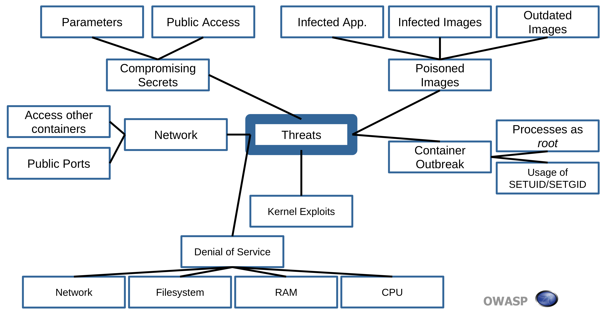

# 脅威モデリング

環境を保護する方法の古典的なアプローチは攻撃者の視点から環境を見て攻撃のベクトルを列挙することです。これがこの章の内容です。

これらのベクトルは保護する必要があるものを定義するのに役立ちます。この定義によりベースラインの保護とそれ以上のものを提供するためのセキュリティコントロールを導入できます。これが以降の章の十のコントロールに関する内容です。

以下の画像は Docker の脅威の概要を示しています。

### 脅威 1: コンテナエスケープ (システム)

このシナリオではアプリケーションはある種のシェルアクセスが可能であるという点で安全ではありません。そのため攻撃者はたとえばインターネットなどからどうにかして攻撃を仕掛けて成功させます。アプリケーションからどうにかして抜け出し、最終的にコンテナに侵入します。コンテナ (container) は名前が示すとおり攻撃者を収容 (contain) することになるようです。

第二ステージでは攻撃者はホストのビューからコンテナユーザーとして、またはカーネルエクスプロイトを用いて、コンテナをエスケープしようとします。最初のシナリオではホスト上のユーザー権限を持つだけでした。第二のシナリオではホストシステムの root になり、そのホストで動作しているすべてのコンテナを制御できるようになります。

### 脅威 2: ネットワークを介した他のコンテナ

このシナリオの最初のステージは前のシナリオと同じです。攻撃者はシェルアクセスを持っていますが、ネットワークを介して別のコンテナを攻撃することを選択します。これは同じアプリケーション、同じ顧客の別のアプリケーション、または別の顧客のマルチテナント環境のいずれかである可能性があります。

### 脅威 3: ネットワークを介したオーケストレーションツールへの攻撃

このシナリオは前の二つと同じ第一ベクトルを持っています。攻撃者はコンテナ内でシェルアクセスできますが、オーケストレーションツール (管理バックプレーン) の管理インタフェースまたはその他の攻撃対象領域を攻撃することを選択します。2018 年にはほとんどすべてのツールにデフォルトのオープン管理インタフェースがある脆弱性がありました。"オープン" とは最悪の場合に認証なしでのオープンポートを意味します。 (要引用)

### 脅威 4: ネットワークを介したホストへの攻撃

これも前述したものと同じ第一ベクトルを持っています。攻撃者はシェルアクセスでホストからオープンポートを攻撃します。それが保護が脆弱であるかまったく保護されていない場合、攻撃者はホストへのユーザーアクセス、あるいはもっと悪いことにルートアクセスを取得します。

### 脅威 5: ネットワークを介した他のリソースへの攻撃

これは基本的に残りのすべてのネットワークベースの脅威を一つのバケットに収集する脅威です。

これも前述したものと同じ第一ベクトルを持っています。攻撃者のシェルアクセスで、たとえばデータの読み取りや変更が可能なコンテナ間で共有されている、保護されていないネットワークベースのファイルシステムが見つかります。別の可能性としてはアクティブディレクトリや LDAP ディレクトリなどのリソースがあります。さらに別のリソースとしては、たとえば誰かがオープンに設定しすぎてコンテナからアクセスできる Jenkins などがあります。

(ARP スプーフィングとスイッチのために説明が必要): 攻撃者がハイジャックしたコンテナにネットワークスニファをインストールして、他のコンテナからのトラフィックを読み取れるようにする可能性もあります。

### 脅威 6: リソース枯渇

基となるベクトルは同じホスト上で動作している別のコンテナからのセキュリティコンディションによるものです。
セキュリティコンディションは他のコンテナが CPU サイクル、RAM、ネットワーク、またはディスク I/O などのリソースを使い切っていることが原因である可能性があります。

また、コンテナがホストファイルシステムにマウントされており、攻撃者がそのファイルシステムを埋め尽くすことで、ホストに問題が発生し、他のコンテナに影響を及ぼすこともありえます。

### 脅威 7: ホストの危殆化

これまでの脅威では、攻撃者はホストを介して間接的に管理して別のコンテナや他のコンテナに影響を与えていましたが、ここでは攻撃者は別のコンテナやネットワークを介してホストを危殆化します。

### 脅威 8: イメージの完全性

CD パイプラインにはミニオペレーティングシステムイメージがデプロイメントに到達するまでにあるステップから次のステップに渡されるいくつかのホップが含まれる可能性があります。

すべてのホップは攻撃者にとって潜在的な攻撃対象領域となります。
攻撃者が一歩足掛かりを得ることに成功し、デプロイされるものがここでデプロイすべきものであるかどうかの完全性チェックがない場合、攻撃者に代わって悪意のあるペイロードを持つイメージがデプロイされるという脅威があります。
